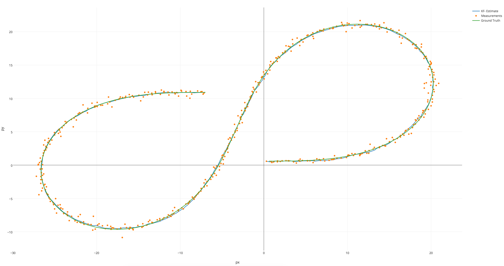
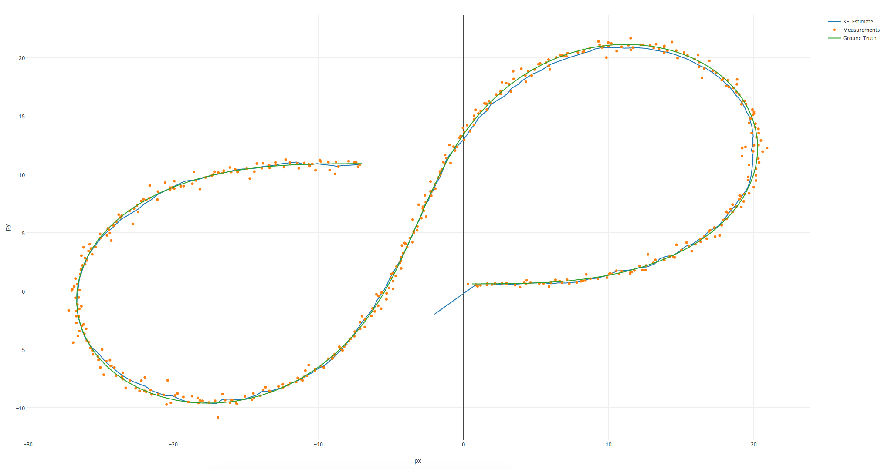
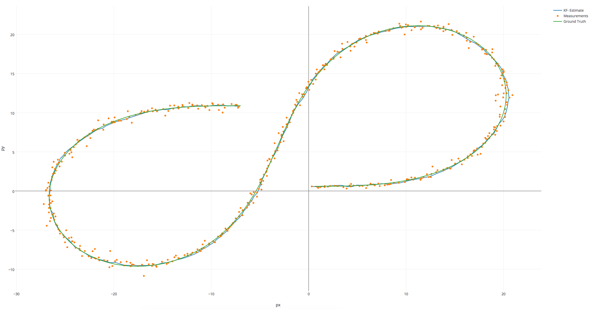

# Unscented Kalman Filter Project Starter Code
Self-Driving Car Engineer Nanodegree Program

---

## Dependencies

* cmake >= v3.5
* make >= v4.1
* gcc/g++ >= v5.4

## Basic Build Instructions

1. Clone this repo.
2. Make a build directory: `mkdir build && cd build`
3. Compile: `cmake .. && make`
4. Run it: `./UnscentedKF path/to/input.txt path/to/output.txt`. You can find
   some sample inputs in 'data/'.
    - eg. `./UnscentedKF ../data/obj_pose-laser-radar-synthetic-input.txt`

## Results
RMSE [px, py, vx, vy]

UKF Radar + Lidar: RMSE [0.0676841, 0.0997594, 0.205464, 0.200668] 

UKF Radar only: RMSE [0.234196, 0.265973, 0.329845, 0.285553]

UKF Lidar only: RMSE [0.157616, 0.146517, 0.298011, 0.21496]

EKF Fusion: RMSE 
